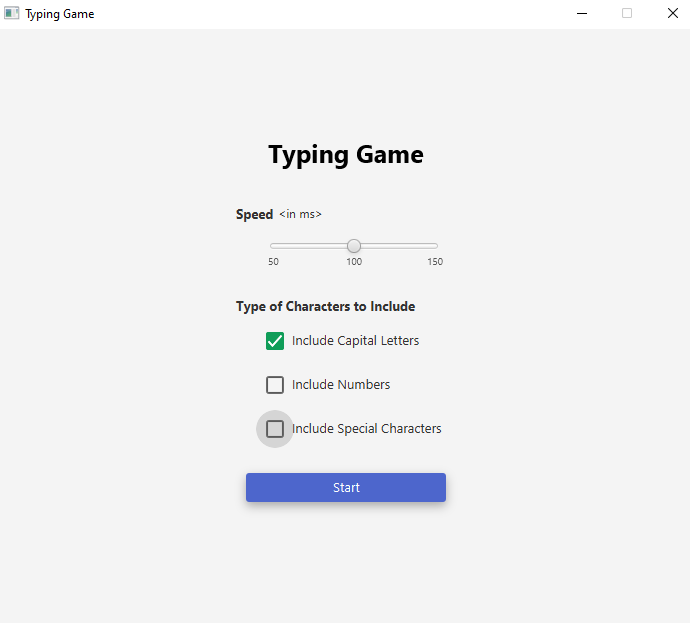
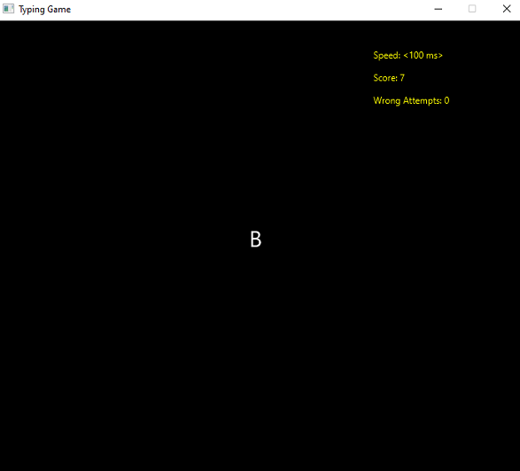
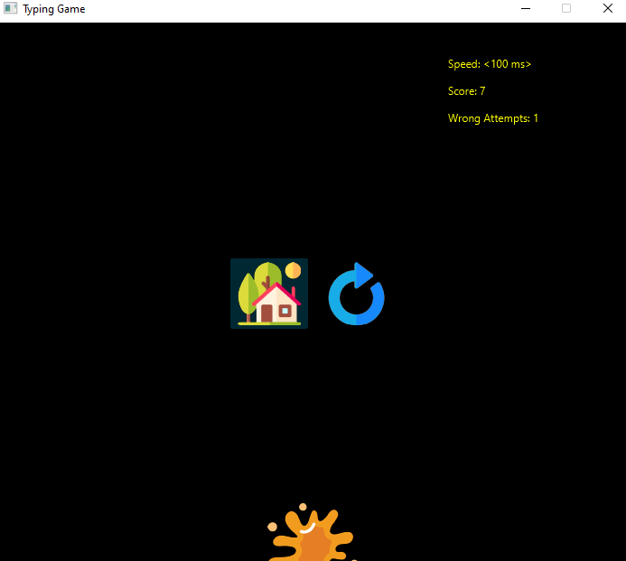

# JavaFXTypingGame 🔥🤘🚀

---

## 👉 Sample screenshots taken from the game

<br>

<br>

<br>

## 👉 Requirements

- JDK - 17.0.2
- JavaFX SDK - 17.0.2
- JFoenix - 9.0.10

## vmArgs Setup

```
--module-path /path/to/javafx-sdk-17.0.2/lib --add-modules javafx.controls,javafx.media
```
